# CloudCleaner

**The World's Most Transparent AI-Powered System Optimizer**

> **"Finally, a cleaner that tells you EXACTLY what it's doing."**

CloudCleaner is a next-generation PC maintenance platform designed for users who care about what happens under the hood. It combines **System Hardening**, **Deep Cache Cleaning**, and **Performance Intelligence** into a single, open-source dashboard. No black boxes. No "magic" buttons. Just pure, auditable engineering.

---

## 🏗️ High-Level Architecture

Understanding how CloudCleaner works starts with its architecture. We use a hybrid approach to ensure maximum speed and safety.

*   **Electron + React UI**: A beautiful, responsive interface that feels like a native app.
*   **The Brain (Python Engine)**: The heavy lifting is done by a compiled Python backend, utilizing mature libraries for file system operations and security analysis.
*   **Secure Bridge**: The frontend and backend communicate via a strictly standardized JSON protocol, ensuring no arbitrary code execution.

---

## 🚀 How It Works: The Cleaning Lifecycle

We don't just "delete files." We follow a rigorous 4-step process to ensure relevant data is kept safe while junk is removed.

```mermaid
sequenceDiagram
    participant User
    participant UI as Dashboard
    participant Engine as Scanning Engine
    participant Safety as Safety Validator
    participant Disk as File System

    User->>UI: Clicks "Scan"
    UI->>Engine: Request System Analysis
    
    rect rgb(240, 248, 255)
        Note over Engine, Disk: Phase 1: Discovery
        Engine->>Disk: Find Cache & Logs
        Engine->>Disk: Check Permissions
    end
    
    rect rgb(255, 240, 245)
        Note over Engine, Safety: Phase 2: Safety Check
        Engine->>Safety: Is this file safe?
        Safety-->>Engine: ✅ Safe / ❌ Protected / 🔒 In Use
    end
    
    Engine-->>UI: Return Categorized Results
    UI->>User: Show Preview (You Decide)
    User->>UI: Clicks "Clean Selected"
    UI->>Engine: Execute Cleanup
    Engine->>Disk: Move to Recycle Bin (undoable)
    Engine-->>UI: Cleanup Complete
```

---

## 🛡️ Safety Systems: Why We Won't Delete Your Homework

Safety is our #1 priority. CloudCleaner implements a triple-layer safety net:

1.  **Global Whitelist**: A hard-coded database of system-critical paths (e.g., `C:\Windows\System32`, `User/Documents`) that are *physically impossible* for the engine to select.
2.  **File Lock Detection**: If an app (like Chrome or Word) is using a file, we skip it to prevent crashes.
3.  **Smart Aging**: We generally ignore files created in the last 24 hours, assuming they might still be relevant to your current session.

---

## 🧠 Feature Deep Dive

### 1. 🧹 Smart Cache Cleaning
Most cleaners just empty your `%TEMP%` folder. We go deeper.
*   **Browser Intelligence**: We can clean Chrome's *Cache* (images, scripts) while preserving your *Cookies* (login sessions) and *History*. You choose the granularity.
*   **Dev Garbage**: Automatically finds `node_modules` cache, old Python `.pyc` files, and leftover Visual Studio build artifacts.
*   **Discord & Spotify**: Cleans the gigabytes of cached media these electron apps store without affecting your playlists or chats.

### 2. 🛡️ Security Audit Engine
Turn your PC into a fortress.
*   **Vulnerability Scanning**: We bundle **Nuclei**, an industry-standard vulnerability scanner, to check if you're running local servers or services with known security holes.
*   **Secret Detection**: Powered by logic similar to **TruffleHog**, we scan your 'Documents' and 'Desktop' for files containing API keys, AWS tokens, or private keys that you might have accidentally saved in plain text.
    > *Note: This scan runs entirely locally. Your keys are never sent to the cloud.*

### 3. ⚡ Performance Diagnostics
*   **Resource Vampire Hunter**: instanly identifies processes that are using more RAM or CPU than they should.
*   **Startup Auditor**: Shows you exactly what launches when you turn on your computer, with a simple toggle to disable them.
*   **Health Score**: An AI-calculated score (0-100) based on your drive fragmentation, available memory, and background load.

---

## 🧭 User Interface Tour

### **The Dashboard**
Your mission control.
*   **System Vitality**: Real-time graphs of CPU and RAM usage.
*   **Quick Actions**: One-click "Smart Scan" for the impatient.
*   **Last Scan Summary**: Reminds you when you last cleaned up.

### **The Scan Page**
Where the magic happens.
*   **The List**: After a scan, every single file is listed. You can expand folders to see individual files.
*   **Risk Indicators**:
    *   🟢 **Safe**: Verified junk.
    *   🟡 **Caution**: e.g., "Browser Cookies" (Logs you out).
    *   🔴 **Warning**: Advanced system logs.
*   **The "Clean" Button**: The only destructive button in the app. Always asks for confirmation.

### **The History Page**
Your audit trail.
*   **Immutable Logs**: Every action is recorded in a SQLite database.
*   **Restore Guidance**: If you deleted something by accident, this log tells you exactly what it was so you can recover it from the Recycle Bin.

---

## ❓ Frequently Asked Questions

**Q: Is it safe to use on my work laptop?**
A: Yes. CloudCleaner does not touch user documents, spreadsheets, or code files by default. It targets system caches and temporary directories. Plus, the **Secret Scanner** can actually help keep your work laptop safer by finding exposed credentials.

**Q: Does it upload my data?**
A: **No.** CloudCleaner is privacy-first. There is no telemetry, no "usage statistics" upload, and no cloud server. Everything happens on `localhost`.

**Q: Can I restore deleted files?**
A: Yes. By default, CloudCleaner moves files to your OS **Recycle Bin / Trash**. They are not permanently erased until you empty the trash yourself.

---

## 💻 CLI Reference (For Developers)

Want to automate your cleanup? Use the engine directly.

| Command | Action |
| :--- | :--- |
| `python main.py --scan --json` | Returns a JSON object of all found junk. |
| `python main.py --clean --items '["path"]'` | Clean specific paths programmatically. |
| `python main.py --security --json` | Run the security suite and get a JSON report. |
| `python main.py --add-exclusion "C:\Work"` | Add a folder to the permanent whitelist. |

---

## 🤝 Contributing

We believe in open source.
*   **Frontend**: React, TypeScript, TailwindCSS.
*   **Backend**: Python 3.11.
*   **Pull Requests**: Welcome! Please see `CONTRIBUTING.md`.

---

**CloudCleaner** © 2026. Engineered for Transparency.
